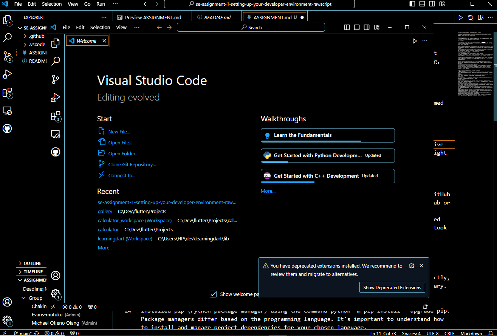
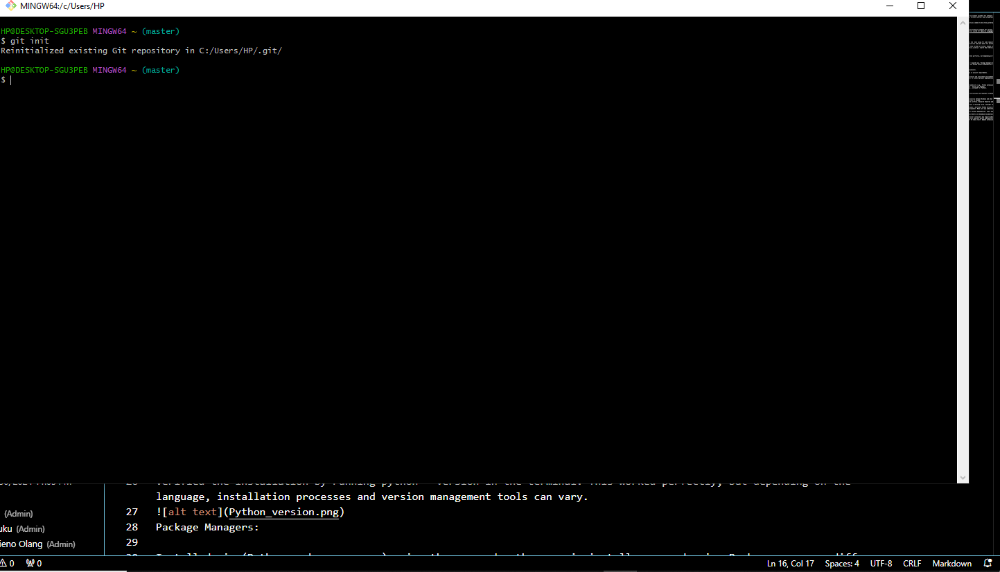
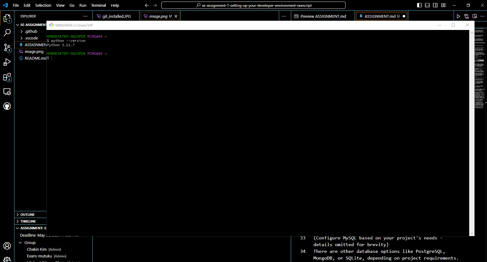
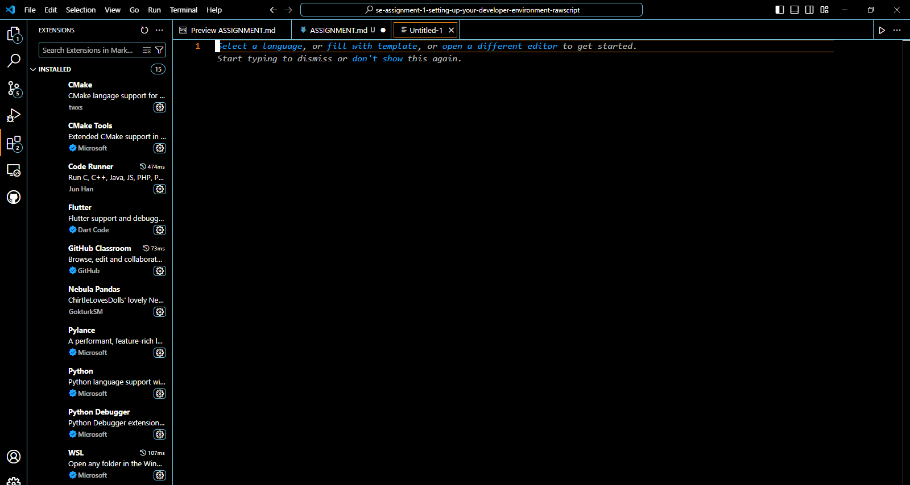

 Developer Environment Setup for Software Engineering Projects

Objective: This document details the setup process for an efficient developer environment suitable for software engineering projects. It covers tools and configurations for coding, debugging, version control, and collaboration.

Operating System (OS):

I went with Windows 11 for this setup, but macOS or Linux from online documentations seemed to be strong alternatives depending on several use cases.

Text Editor/IDE:

I installed Visual Studio Code (VS Code)which is a versatile and popular IDE with extensive support for various programming languages. Other options like PyCharm or IntelliJ IDEA might be better suited for specific languages.

Version Control System (VCS):

Downloaded and installed Git from https://www.git-scm.com/downloads.
I had already created a GitHub account at https://github.com/index.html which I had  been using for code repository hosting.Over time I have grown to love GitHub since it offers free public repositories and paid plans for private ones.

Here, I ran into a slight detour. Initializing a Git repository directly in VS Code turned out to be a breeze, but understanding the initial commands like git init and git commit took some practice.Luckily I learnt that there are plenty of tutorials online to help with gettting started with git commands
Finally, I made an initial commit to my local repository.
Programming Languages & Runtimes:

I chose Python from https://www.python.org/ as an example language.
Verified the installation by running python --version in the terminal. This worked perfectly, but depending on the language, installation processes and version management tools can vary.

Package Managers:

Installed pip (Python package manager) using the command python -m pip install --upgrade pip. Package managers differ based on the programming language. It's important to understand how to install and manage project dependencies for your chosen language.
Database (Optional):

Downloaded and installed MySQL database from https://dev.mysql.com/downloads/installer/.
(Configure MySQL based on your project's needs - details omitted for brevity)
There are other database options like PostgreSQL, MongoDB, or SQLite, depending on project requirements.
Development Environments & Virtualization (Optional):

Extensions & Plugins (VS Code):

I explored and installed some useful extensions in VS Code:
Syntax highlighting: Provides language-specific color coding for better code readability (e.g., Python extension).

Linting: Identifies potential errors and stylistic inconsistencies in code
Code formatting: Enforces consistent code style for better maintainability .
Version control integration: Streamlines Git integration within VS Code.
Documentation:

This document serves as a record of the setup process, including step-by-step instructions and relevant screenshots (add screenshots as needed).
Potential Problems:

Operating System: I encountered alot of problems especially trying to install wiindows 11 bearing in mind I had stopped using windows and switched to linux, the erntire process was not as straight forward as expected in most scenarios.

Programming Languages & Runtimes: I actually ran into a compatibility issue between a different Python version I had and the pip package manager. It took some troubleshooting to sort out dependency management. Make sure you understand how to handle these for your chosen language.
